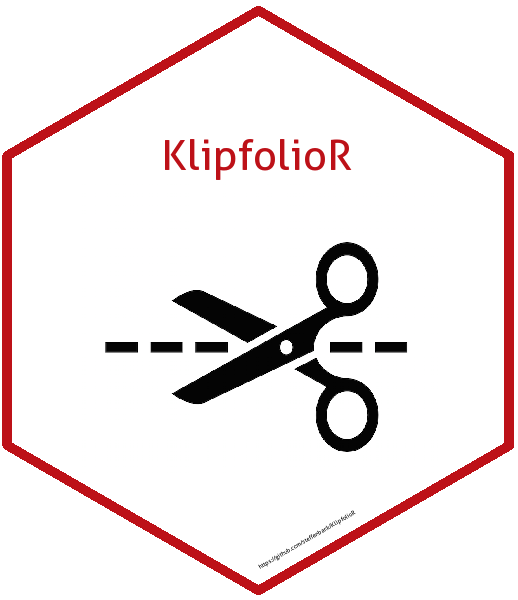

# KlipfolioR 

The goal of KlipfolioR is to enhance the use of Klipfolio by the use of R.


## Installation

You can install KlipfolioR from github with:


``` r
# install.packages("devtools")
devtools::install_github("steffenbank/KlipfolioR")
```

## Putting data into Klipfolio

The main use of `KlipfolioR` is to enable the use of advanced data manipulation methodologies from R in Klipfolio. To do that the Klipfolio API is enabled by using a simple function, `klipfolio_put`. The datamanipulation is performed is R and the API is used to put the data into Klipfolio

Due to privacy it is not possible to construct an real-life example - made up crecidentials are applied.  

``` r
input_data <- head(mtcars)
input_datasource <- "1234abcd"
input_email <- "klipfolior@klipfolior.com"
input_password <- "secret_klipfolior"
```


`klipfolio_put` may be called directly or piped in by `%>%`:

``` r
library(magrittr)

# direct call
klipfolio_put(data = input_data, 
              datasourceID = input_datasource, 
              email = input_email, 
              password = input_password)
              
# pipe
input_data %>% klipfolio_put(., 
              datasourceID = input_datasource, 
              email = input_email, 
              password = input_password)

```

## Other functions
The package contains a (growing) number of other functions. Most of them are ment to easen the management of a complicated Klipfolio account as an admin. The functions gives the admin ability to answer questions as

1. How many users/groups/klips/dashboards do we have?
2. How are each datasource/klip/dashboard linked together?
3. How many datasources are not used?


